# Continuously Deploy Containers

## 1. Set-up your Azure Repository</h2>

- Authenticate with Azure Repos
- You can set-up the remote origin using either SSH or HTTPs. Git now recommends HTTPs.
- If you're using SSH, it is recommended to use **Personal Access Tokens** (PAT). Another way would be to authenticate using **SSH keys**. You can set-up PATs or SSH keys from the **User Settings** of Azure DevOps.
- On the other hand, if you're using HTTPs, use _Git Credential Manger_ which is available upon installing Git. On your initial push, a pop-up will open asking you to log-in.

## 2. Create your Azure Container Registry

- You can activate an **Admin User** from the **Access Keys** page.
- If activated, you can use the registry name as username and admin user access key as password to `docker login` to your container registry.
- This will also add values to the following environment variables once the App Service has been created.
  - `DOCKER_REGISTRY_SERVER_USERNAME`
  - `DOCKER_REGISTRY_SERVER_PASSWORD`
- If you don't activate this, you won't be able to authenticate your Web App via _Admin Credentials_.

  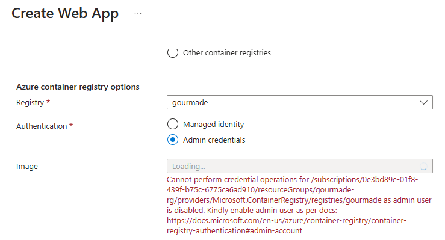

### 3. Create a Managed Identity

- Instead of activating an _Admin User_, create a Managed Identity for the Web App instead.
- Assign the **AcRPull** role.

  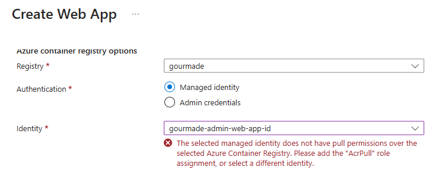

## 4. Create a Docker Registry Connection for the Build & Push Stage

- Service connections are authenticated connections between Azure Pipelines and external or remote services that you use to execute tasks in a job.
- For example, your pipelines might use the following categories of service connections.
  - Azure Subscriptions
  - Different build servers or file servers such as a standard GitHub Enterprise Server service connection to a GitHub repository.
  - Jenkins Service Connection
  - Services installed on remote computers such as an Azure Resource Manager service connection to an Azure Virtual Machine with a managed service identity.
  - External services such as a service connection to a Docker Registry, Kubernetes cluster, or Maven repository.
- Go to **Project Settings** > **Pipelines** > **Service Connections**.
- Select **Docker Registry** as the type of connection.
- Select **Service Principal** as the the type of authentication.
- On save, this will actually register an app. Immediately rename the application so you won't forget what it is for.

## 5. Write the YML File for the Build and Push Stage

- You can just use the **Docker: Build and push an image to Azure Container Registry** template.
- Upon using this template, this will actually create a different Docker Registry service connection. It did not pick up the service connection that you just created from <a href="#4-create-a-docker-registry-connection-for-the-build--push-stage">step #4</a>. That's why you'll suddenly have more service connections than you initially created.

  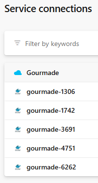

- Every time you use this template and abort the creation of the pipeline, the service connection has already been created.

- If you try to change the ID of the `dockerRegistryServiceConnection` to a service connection ID for an Azure Resource Manager, you'll get an error.

  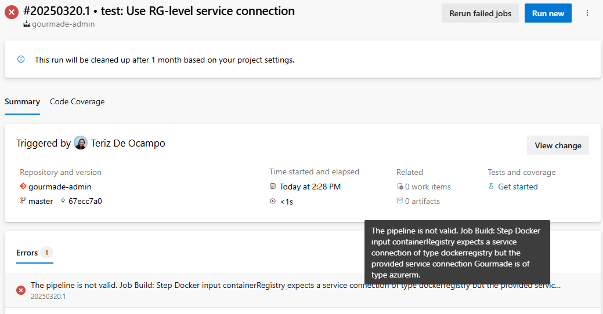

- The authentication type that the template used is **Service Principal**.

  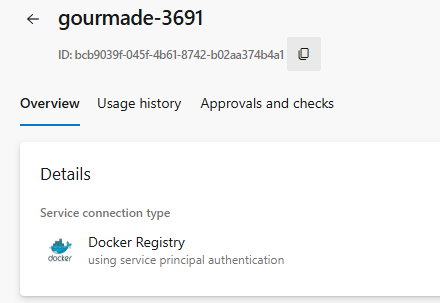

- You can also use **Basic Authentication**, if you have activated an Admin User for the Azure Container Registry.

  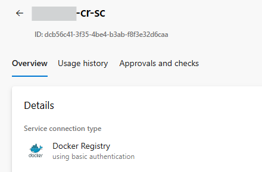

- When using Service Principal Authentication from the template, a new application is automatically registered in the background. As a result, each trial and aborted pipeline creation generates a new application with a unique client secret.

  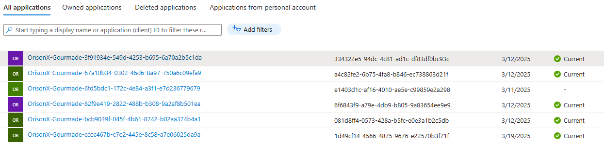

- Note that the client ID and client secret are not referenced in the YML file. This is abstracted away using the service connection. The Docker Service Registry Connection handles token acquisition behind the scenes.

### When to use a Service Principal?

While most articles would recommend using a Managed Identiy over Service Principal because no credentials have to be stored and rotated, Microsoft does not recommend it for this case.

Use a Service Principal when a **service** or a platform needs access to **resources**.

You should use a Service Principal to provide registry access in headless scenarios. That is, an application, service, or script that must push or pull container registries in an automated or otherwise unattended manner.

> [!NOTE]
> Headless Authentication means no interactive log-in, think of popping up a browser window. Which really means, whatever needs to access your container registry can do so without user interaction.

### When to use a Managed Identity?

Use Managed Identity when you want to authenticate between **resources**. Remember that managed identities are always linked to an Azure Resource, not to an application or 3rd party connector.

For example, you'd want to set-up a **user-assigned** or **system-assigned** managed identity on a Linux VM to access container images from your container registry.

If you try to use a service connection authenticated with Managed Identiy, you'll get the following error.

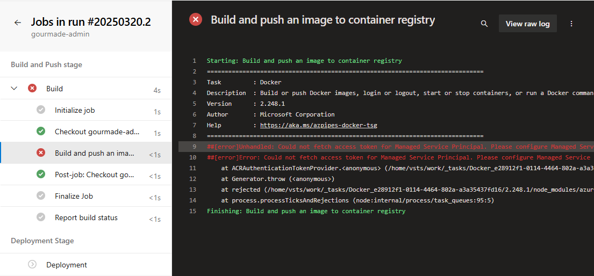

If you are choosing managed identity while creating service connection in Azure DevOps, then you should use Azure DevOps Self-Hosted Agent. [Learn more.](https://stackoverflow.com/questions/76434372/unhandled-could-not-fetch-access-token-for-managed-service-principal-in-azure)

## 6. Create a Web App

- Create a new Web App using Linux for Containers.
- At the **Container** tab > **Azure container registry options** > **Registry**, select the registry that you created from <a href="#2-create-your-azure-container-registry">step #2</a>.
- At **Identity**, select the managed identity you created at <a href="#3-create-a-managed-identity">step #3</a>.
- At **Image**, specify the image repository that was created from running the pipelines at <a href="#5-write-the-yml-file-for-the-build-and-push-stage">step #5</a>.
- After successful deployment, check the website.

## 7. Create an Azure Resource Manager Service Connection for the Deployment Stage

- Create a new service connection. This time, select **Azure Resource Manager** as the type of service connection.
- Limit the access to the resource group of the project.

  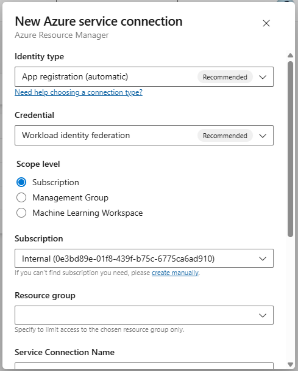

## 8. Write the YML file for the Release Stage

- Use the Service Connection that you created from <a href="#7-create-an-azure-resource-manager-service-connection-for-the-deployment-stage">step #7</a>.

## What happens if the client secret for the Docker Service Registry Connection has expired?

- As soon as Azure DevOps reaches the task for pushing a docker image, it will throw _"unauthorized: Invalid clientid or client secret."_
- Delete the expired secret and create a new one at the App Registrations.
- Edit the Service Connection, and hit save. It's okay if no actual changes were made. While saving, it will automatically refresh the service connection credentials.

## [Workload Identity Federation](https://learn.microsoft.com/en-us/entra/workload-id/workload-identity-federation)

> Workload Identity Federation (WIF) is a security framework that allows applications and workloads to authenticate to cloud services using short-lived tokens. It completely eliminates the need to manage and store long-lived credentials like passwords, API keys, or service account keys.

Workload Identity Federation enables secure access to Microsoft Entra protected resources without managing secrets.

You can use workload identity federation in scenarios such as GitHub Actions, workloads running in Kubernetes, or workloads running in compute platforms outside of Azure.

### Why use workload identity federation?

Typically, a software workload (such as an application, service, script, or container-based application) needs an identity in order to authenticate and access resources or communicate with other services.

When these workloads run on Azure, you can use managed identities and the Azure platform manages the credentials for you.

But. For a software workload running outside of Azure, or those running in Azure but use app registrations for their identities, you need to use application credentials (a secret or certificate) to access Microsoft Entra protected resources (such as Azure, Microsoft Graph, Microsoft 365, or third-party resources).

These credentials pose a security risk and have to be stored securely and rotated regularly. You also run the risk of service downtime if the credentials expire.

You use Workload Identity Federation to configure user-assigned managed identity or app registration in Microsoft Entra ID to **trust tokens** from an external idendity provider (IdP), such as GitHub or Google.

Once that trust relationship is created, your external software workload exchanges trusted tokens from the external IdP for access tokens from Microsoft Identity platform. Your software workload then uses that access token to access the Microsoft Entra protected resources.

This way, you eliminate the maintenance burden of manually managing credentials and eliminates the risk of leaking secrets or having certificates expire.

### How it works

The steps for configuring the trust relationship differs, depending on the scenario and external IdP. That is, the federated credential must have already been configured before running the external workload. The workflow for exchanging an external token for an access token is the same, however, for all scenarios.

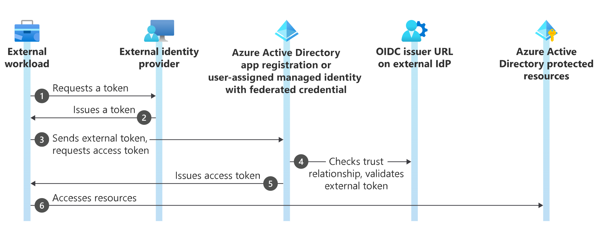

1. The external workload (such as GitHub Actions workflow) requests a token from from the external IdP (such as GitHub).
2. The external IdP issues an OIDC token to the external workload.
3. The external workload (e.g., the sign in action in a GitHub workflow) sends the token to Microsoft Identity platform and requests an access token.
4. Microsoft Identity Platform checks the trust relationship on the user-assigned managed identity or app registration and validates the external token against the OpenID Connect (OIDC) issuer URL on the external IdP.
5. When the checks are satisfied, Microsoft Identity platform issues an access token to the external workload.
6. The external workload accesses Microsoft Entra protected resources using the access token from Microsoft Identity platform. A GitHub Actions workflow, for example, uses the access token to publish a web app to Azure App Service.

### How it works in Azure DevOps

At <a href="#7-create-an-azure-resource-manager-service-connection-for-the-deployment-stage">step #7</a>, this is the setup point that leads to the federated credential being created.

More precisely, Azure DevOps automatically handles:

1. Creating an app registration / service principal.
2. Creating a federated credential on that app registration.
3. Setting the federated credential values:
   - Issuer: Azure DevOps OIDC issuer URL `https://vstoken.dev.azure.com/{organization-id}`
   - Subject: `sc://org/project/service-connection-name` where `sc` stands for Service Connection
   - Audience: `api://AzureADTokenExchange`
4. Assigning Azure RBAC permission based on the selected scope.

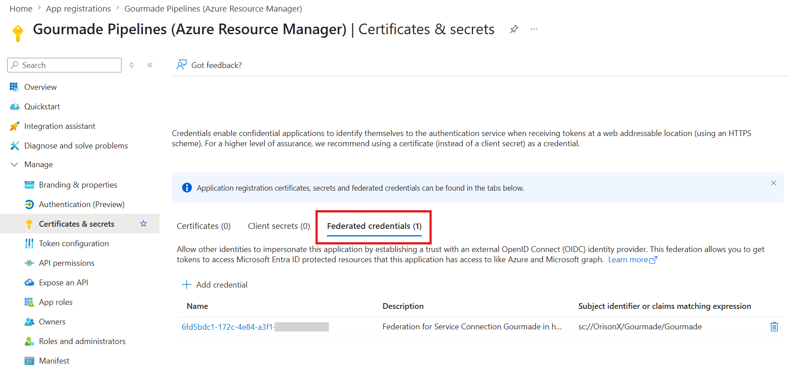

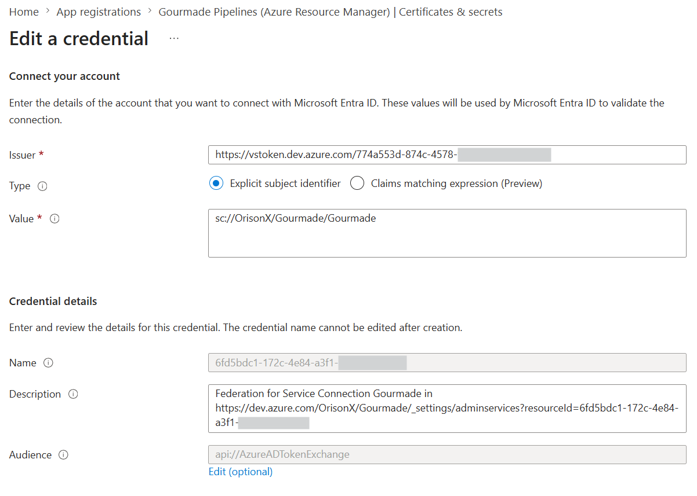

**Explicit subject identifier** means Entra ID will validate the token using one exact `subject` value.

```
Only accept an OIDC token if its subject claim is exactly:
sc://OrisonX/Gourmade/Gourmade
```

That is different from **Claims matching expression** which would allow a pattern/rule instead of one exact value.

The workflow is then the same:

1. The Azure DevOps pipeline job requests an OIDC token from Azure DevOps.
   ```
   External Workload = Azure DevOps Pipeline/Job
   External IdP = Azure DevOps Token Service
   ```
2. Azure DevOps issues a short-lived OIDC token to the pipeline job.
3. The Azure DevOps task sends that OIDC token to Microsoft Entra ID and requests an access token.
4. Microsoft Entra ID checks the federated credential on the app registration or user-assigned managed identity.
5. If the checks pass, Microsoft Entra ID issues an Azure access token to the Azure DevOps pipeline job.
6. The Azure DevOps pipeline uses that Azure access token to access Azure resources.

### How it fits into the picture

The mental model is:

- **Identity**: Who is Azure DevOps acting as?
- **Authentication**: How does Azure DevOps prove it can act as that identity?
- **Authorization**: What is that identity allowed to do?

Workload Identity Federation is only one possible authetication method.

#### ARM Service Connection using Workload Identity Federation

- **Identity**: App Registration / Service Principal
- **Authentication**: Workload Identiy Federation
- **Authorization**: Contributor on resource group

#### ARM Service Connection using Client Secret

- **Identity**: App Registration / Service Principal
- **Authentication**: Client Secret
- **Authorization**: Contributor on resource group

#### Docker Registry Service Connection using Service Principal

- **Identity**: App Registration / Service Principal
- **Authentication**: Client Secret or Token-Based Credential
- **Authorization**: AcrPush on Azure Container Registry

#### Publish Profile Deployment (Not Recommended)

- **Identity**: App Service Publish Profile
- **Authentication**: Publish Profile username & password. Basic authentication is disabled by default on all newly created App Services. To toggle this on, go to App Service > _Configuration_ > _SCM Basic Auth Publishing Credentials_.
- **Authorization**: Deploy to that specific App Service

App Registration or Managed Identity answers "**who are you?**", while Workload Identity Federation, client secret, certificate, managed identity login, or publish profile answers "**how do you prove it?**".
