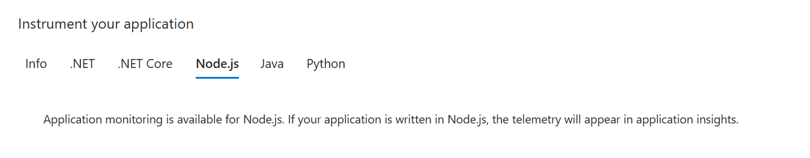
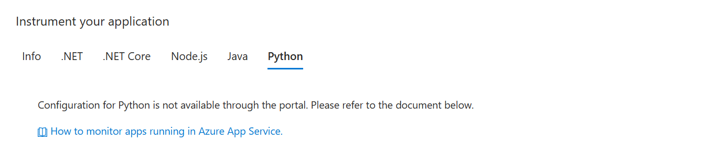

# [Application Insights](https://learn.microsoft.com/en-us/azure/azure-monitor/app/nodejs)

Even without installing the App Insights SDK into your Node.js app, you'll already receive logs. Unlike App Service Logs, it won't automatically capture any telemetry.

```http
GET /robots933456.txt
URL: https://gourmade-api.azurewebsites.net/    Response code: 304    Response time: 3ms
```

```http
GET /
URL: https://gourmade-api.azurewebsites.net/    Response code: 304    Response time: 12ms
```

```http
GET /menu/1
URL: https://gourmade-api.azurewebsites.net/menu/1    Response code: 200    Response time: 2 ms
```

```http
POST /menu
URL: https://gourmade-api.azurewebsites.net/menu    Response code: 201    Response time: 61 ms
```

```http
POST /dietary-plan
URL: https://gourmade-api.azurewebsites.net/dietary-plan    Response code: 400    Response time: 16 ms
```

## Instrumentation Methods

At a basic level, _"instrumenting"_ is simply enabling an application to capture telemetry.

**Autoinstrumentaiton** enables telemetry collection through configuration without touching the application's code. Although it's more convenient, it tends to be less configurable. It's also not available in all languages. When autoinstrumentation is available, it's the easiest way to enable Azure Monitor Application Insights.




**Manual Instrumentation** is coding against the Application Insights or Open Telemetry API. You can use this option if you need to make custom dependency calls or API calls that are not captured by default with autoinstrumentation.

## Should I use single or multiple Application Insights?

Use a single resource for all the components or roles in a single business system. Use separate resources for different environments, release version, and for independent applications.

Remember that you could always filter by **Cloud Role Name**.

According to a Microsoft forum, the app version can be set via `telemetryClient.Context.Component.Version`. It looks like it pertains to .NET. From the JavaScript SDK, it can be set via `client.context.keys.applicationVersion`.

> [!WARNING]
> After testing `client.context.keys.applicationVersion`, application versions of all logs are empty for the dev environment. Whereas production environment all have a version of 1.3.8, but I don't know where Azure pulled it.

## Other Loggers

By default, `setAutoCollectConsole` is configured to exclude calls to `console.log` and other console methods. Only calls to supported third-party loggers (for example, winston and buyan) will be collected. You can change this behavior to include calls to `console` methods by using `setAutoCollectConsole(true, true)`.

## [Azure App Service Logging vs. Application Insights Integration](https://learn.microsoft.com/en-us/answers/questions/498547/azure-app-service-logging-vs-application-insights)

> [!TIP]
> Is it enough to just configure Applicatio Insights?

Azure provides built-in diagnostics mechanism - **App Service Logs** - to assist with debugging an App Service app. Basically, you will have to go through the logs to see what is happening. Nonetheless, you can query from the monitoring section.

**Application Insights**, as the name suggests (_Insights_), provides a lot more features on top of just being able to view logs. Most importantly, you can query the logs.

Use the logs at the Deployment Center when an App Service is failing to start. For everything else, use Application Insights.

## Costing

The first 5 GB per month per billing account are free. If Application Insights is making your app not profitable, have a look at [Azure Application Insights - How not to burn money using it](https://medium.com/@beyerleinf/azure-application-insights-how-not-to-burn-money-using-it-5f1bbe5816b4).
