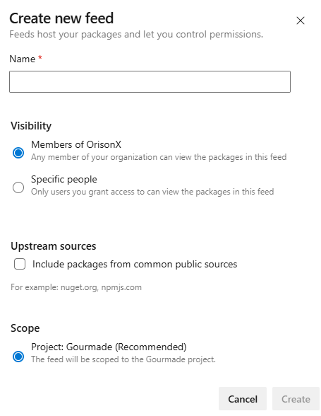

# Accessing Azure Artifacts NPM Feed

When creating a new feed, you have an option to include packages from public sources.



If this is checked, installing your uploaded custom package will automatically save the dependency packages in your feed to save time for future installs.

Azure Artifacts provides 2 GB of free storage for each organization. For cost optimization, uncheck this and just download from the upstream source every time an install is made.

## 1. Add .npmrc to your project

```
registry=https://pkgs.dev.azure.com/OrisonX/Gourmade/_packaging/Gourmade/npm/registry/

always-auth=true
```

You can also scope packages. Npm scopes serve as a means to categorize related packages into groups. These scopes enables you to create packages with identical names to those created by different users without encountering conflicts.

```
@ScopeName:registry=https://pkgs.dev.azure.com/<ORGANIZATION_NAME>/<PROJECT_NAME>/_packaging/<FEED_NAME>/npm/registry/

always-auth=true
```

Using this approach, only scoped packages will be published and installed from the private registry. All other packages will be installed from the default registry (https://registry.npmjs.org).

Make sure to include both the scope and package names in your `package.json` file as `{ "name": @ScopeName/PackageName }`.

So, if you have `{ @gourmade/utils }` at `package.json`, your `.npmrc` should look as follows.

```
@gourmade:registry=https://pkgs.dev.azure.com/OrisonX/Gourmade/_packaging/Gourmade/npm/registry/

always-auth=true
```

## 2. Set-Up Credentials

### a. Using vsts-npm-auth

```bash
vsts-npm-auth -config path-to-your\.npmrc
```

Azure DevOps was formerly named as Visual Studio Team Services (VSTS). `vsts-npm-auth` is an authentication bootstraper. It reads the `.npmrc` file you specified with `-config` to determine the registry URLs that require authentication.

It will then write the generated token into your global `.npmrc` file which is at `C:\Users\Theresa\.npmrc`.

If you've issued this for multiple URLs, you'll have a `username` and `password` set for each project at the global `.npmrc`.

### b. Manually Generating a PAT

#### Copy the code below to your `.user.npmrc`

```
; begin auth token
//pkgs.dev.azure.com/OrisonX/Gourmade/_packaging/Gourmade/npm/registry/:username=OrisonX
//pkgs.dev.azure.com/OrisonX/Gourmade/_packaging/Gourmade/npm/registry/:_password=[BASE64_ENCODED_PERSONAL_ACCESS_TOKEN]
//pkgs.dev.azure.com/OrisonX/Gourmade/_packaging/Gourmade/npm/registry/:email=npm requires email to be set but doesn't use the value
//pkgs.dev.azure.com/OrisonX/Gourmade/_packaging/Gourmade/npm/:username=OrisonX
//pkgs.dev.azure.com/OrisonX/Gourmade/_packaging/Gourmade/npm/:_password=[BASE64_ENCODED_PERSONAL_ACCESS_TOKEN]
//pkgs.dev.azure.com/OrisonX/Gourmade/_packaging/Gourmade/npm/:email=npm requires email to be set but doesn't use the value
; end auth token
```

Each field (`username`, `_password`, and `email`) are duplicated. One set of credentials is for the full registry URL, another set is for the base registry URL.

#### Generate a Personal Access Token with _Packaging_ read and write scopes.

Base64 encode the PAT.

1.  From the command prompt, run:

```bash
node -e "require('readline') .createInterface({input:process.stdin,output:process.stdout,historySize:0}) .question('PAT> ',p => { b64=Buffer.from(p.trim()).toString('base64');console.log(b64);process.exit(); })"
```

2. Paste your PAT, and hit Enter.
3. Copy the Base64 encoded value.
4. Replace both `[BASE64_ENCODED_PERSONAL_ACCESS_TOKEN]`.

## [How to specify which identity to use with `vsts-npm-auth`?](https://stackoverflow.com/questions/78022170/how-do-i-specify-which-identity-to-use-with-vsts-npm-auth)

The current latest version - `v0.43.0.0` - is problematic for multiple accounts. It does not provide parameters for selecting an account nor reset or change existing credentials.

As a workaround, rollback to `v0.42.1.0`.

1. `npm uninstall -g vsts-npm-auth`
2. `npm install -g vsts-npm-auth@0.42.1 --registry https://registry.npmjs.com --always-auth false`
3. `vsts-npm-auth -config .npmrc -F -V Detailed` - this will force you to sign in again.

## [Accessing from the Docker Build](https://medium.com/@sikorski.m.p/accessing-azure-artifacts-npm-feed-from-the-docker-build-2e084005315e)

TODO
