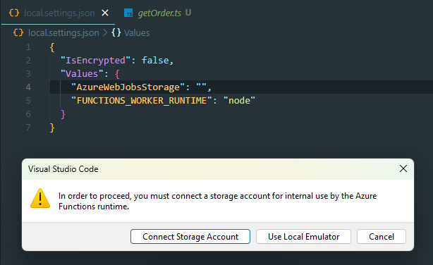
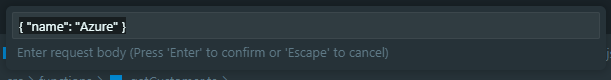
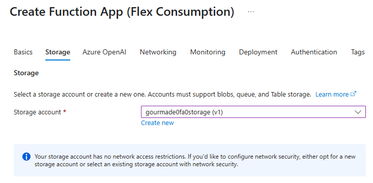
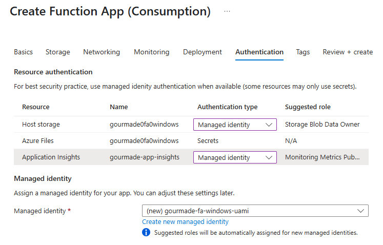
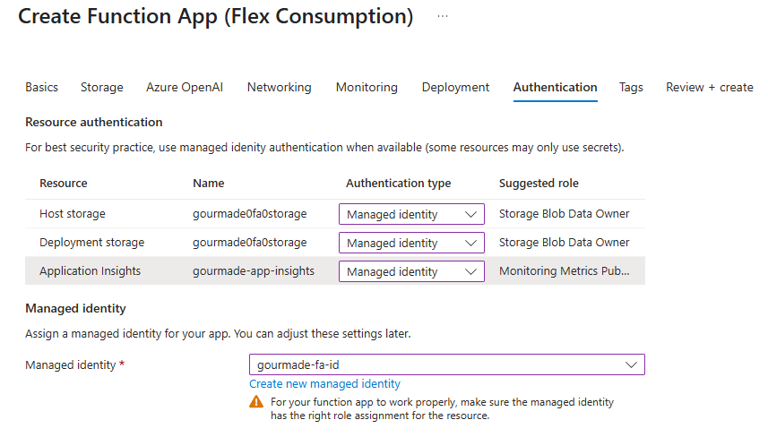
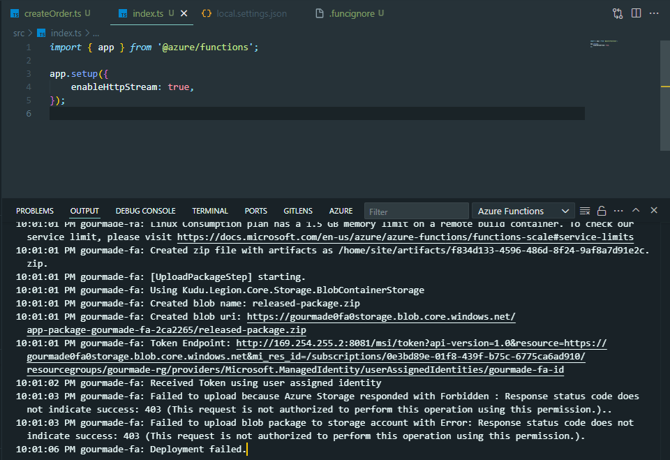
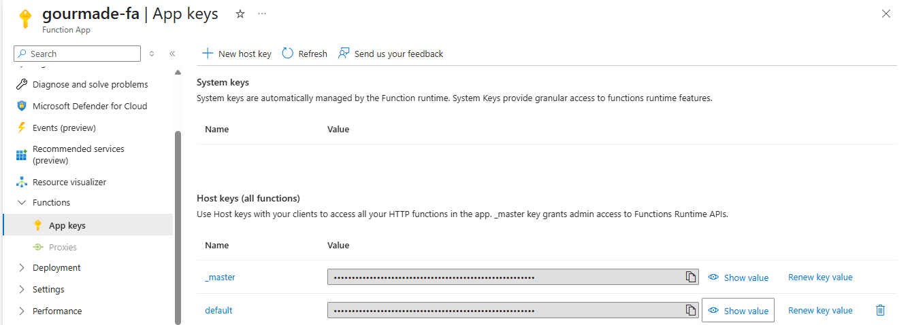
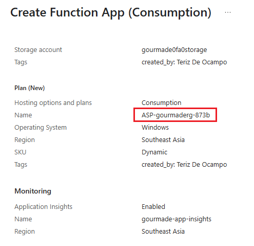
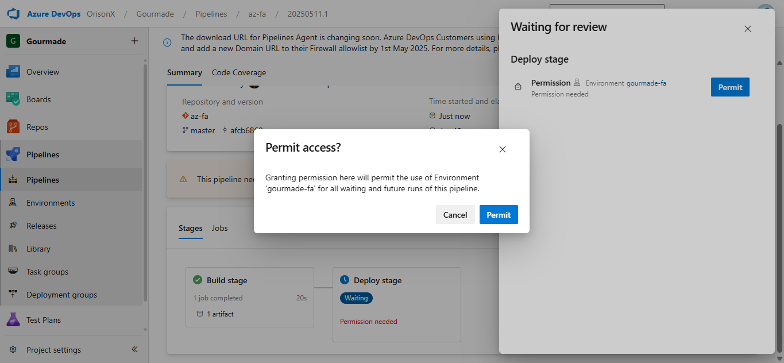
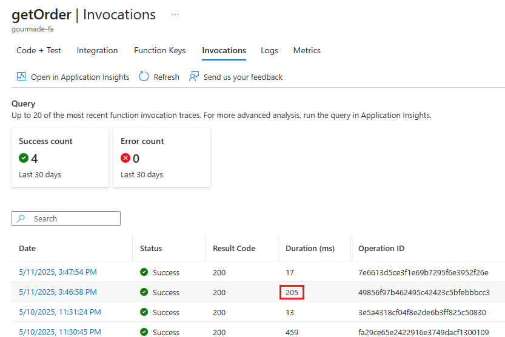

# [Azure Functions](https://learn.microsoft.com/en-us/azure/azure-functions/create-first-function-vs-code-typescript?pivots=nodejs-model-v4)

## Creating the Project

You can create your first Azure Functions project using Visual Studio Code: `Azure Functions: Create New Project`. Each function will require you to import `app` which is the main Azure Functions app instance where you register your functions.

You can then run it locally using Run and Debug. You'll get the following prompt.



You'll just have to set `AzureWebJobsStorage` to `skip`, and you can run the sample function.

## Running Locally

Here's the sample function from the boilerplate.

```javascript
const name = request.query.get("name") || (await request.text()) || "world";
```

Take note that the prompt from VS code is for the request body, and not query parameters. Entering `Teriz` will return `"Hello, "Teriz"!"`, while `{ "name": "Teriz" }` will return `"Hello, {"name":"Teriz"}!"`



Change `text` to `json` instead.

```javascript
const name = request.query.get("name") || (await request.json()) || "world";
```

You can confirm that VS Code sends the request with `Content-Type: application/json` by accessing `request.headers.get("content-type")`.

## Create the Function App in Azure

The Flex Consumption plan is recommend for Linux.

If you create a Function App using the Flex Consumption plan, by default, it will create a Storage Account wherein the public network access is enabled from all networks.

Try to create another Function App using the Flex Consumption plan. For the storage account, use the storage account that was created previously. Azure Portal will give the following warning.



When you select a storage account for a Flex Consumption Plan, Azure recommends one with network security enabled. This is because Flex is designed for more secure cases, often involcing VNET integration. The message is just a guidance prompt saying "We recommend you use a storage account that can be locked down for security." If you use an existing storage used by other resources, it might limit you from performing isolation in the future.

### Resource Authentication

- Different resources will be created depending on your plan.




- If the Managed Identity is not configured with a Storage Blob Data Data Owner role assignment, you'll get authentication issues with the deployment.



- The **Storage Blob Data Owner** role grants the highest level of data access, enabling users to manage POSIX access control and other data-related settings for blobs and containers. This role supersedes the permissions of **Storage Account Owner** when it comes to managing data within the storage account. The **Storage Account Owner** role, while granting full management of the storage account itself, does not automatically grant access to the blob data.

## Function Access Keys

Functions lets you use keys to make it harder to access your function enpoints. Unless the HTTP access level on an HTTP triggered function is set to `anonymous`, requests must include an access key in the request.

### Authorization Level

The authorization level is a string value that indicates the kind of authorization key that's required to access the function endpoint. For an HTTP triggered function, the authorization level can be one of the following values.

- `anonymous` - No access key is required
- `function` - A function-specific key is required to access the endpoint. This can be retrieved by selecting the function > Function Keys (located next to the Integration tab).
- `admin` - The master key is required to access the endpoint.

### App Keys



#### 🔑 `_master` Key

- **Highest-level** key for the entire Function App.
- Grants full admin access to:
  - All functions in the app, regardless of the access level.
  - Administrative endpoints, i.e., `/admin/*` APIs.

#### 🔑 `_default` Key

- A **host-level** key for invoking any function in the app that uses the `function` authorization.
- Does not allow access to admin endpoints.
- Can be used by clients needing access to multiple functions without sharing individual keys.

### [How to rename the App Service plan name?](https://jaliyaudagedara.blogspot.com/2020/08/azure-functions-consumption-plan-custom.html)



Unfortunately, you cannot change the Azure Function App Service plan after creation. But, you can create new Azure Function with your choice of name using ARM template. At the Review + Create tab, download the template and change the name before deployment.

## Deployment

Just use the **Node.js Function App to Linux in Azure** template, this will require a Resource Manager service connection. It will also ask for permissions the first time that the pipeline runs.



## Running in Azure

Aside from the portal, you can also run functions in production using VS Code in two ways.

- `Azure Functions: Execute Function Now`
- Select the Azure icon in the activity bar > Resources > Function App > gourmade-fa > Functions

Invocations from VS Code tend to have more delays.


