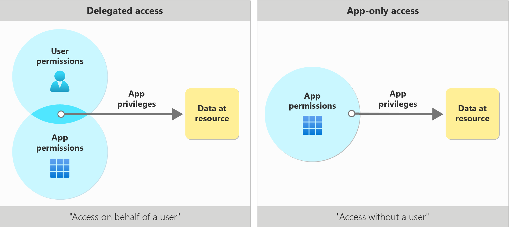

# [Overview of Permissions and Consent in the Microsoft Identity Platform](https://learn.microsoft.com/en-us/entra/identity-platform/permissions-consent-overview)

This article provides an overview of the foundational concepts and scenarios related to permissions and consent, helping application developers request the necessary authorizations from users and administrators. By understanding these concepts, you can ensure your applications ony request the access they need.

To access a protected resource like email or calendar data, your application needs the resource owner's authorization. The resource owner can consent to or deny your app's request.

## Access Scenarios

As an application developer, you must identify how your application access data. The application can use:

- Delegated Access - acting on behalf of a signed-in user
- App-Only Access - acting only as the application's own identity.

## Delegated Access

In this access scenario, a user has signed into a client application. The client application accesses the resource on behalf of the user. Delegated access requires delegated permissions. **Both the client and the user must be authorized separately to make the request**.

**Delegated permissions** can also be referred to as **scopes**. Scopes are permissions for a given resource that represent what a client can access on behalf of the user.

## App-Only Access

In this access scenario, the application acts on its own with no user signed in. Application access is used in scenarios such as automation and backup. This scenario includes apps that run as background services or daemons. It's appropriate when it's undesirable to have a specific user signed in, or when data required can't be scoped to a single user.

App-only access uses **app roles** instead of delegated scopes. When granted through consent, app roles might also be called **application permissions**.

For example, an application granted with the Microsoft Graph API's application permission `Files.Read.All` is able to read any file in the tenant using the Microsoft Graph. In general, only an administrator or owner of an API's service principal can consent to application permissions exposed by that API.
