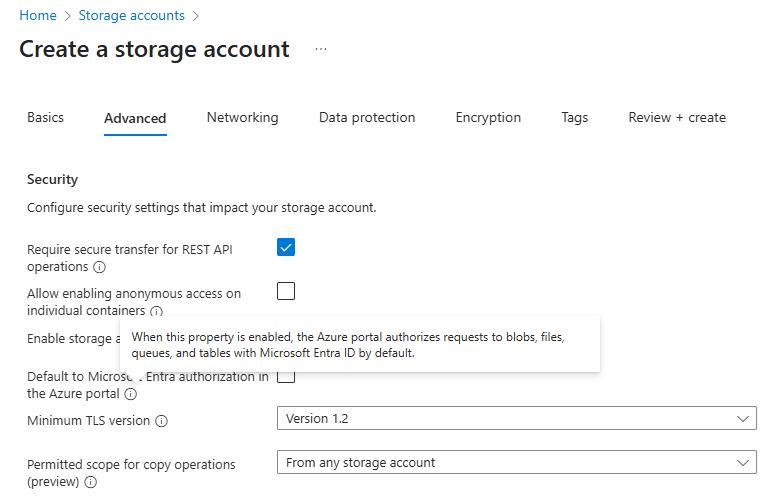
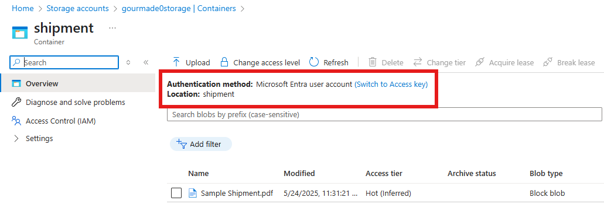
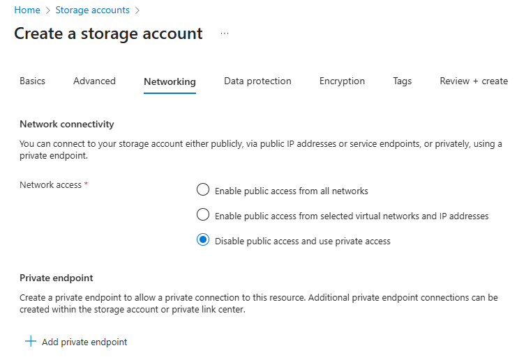
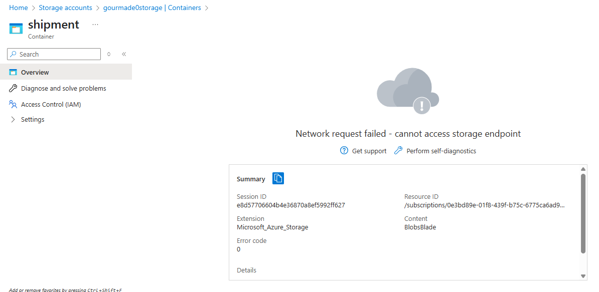

# Create Storage Account

## Security

If **Default to Microsoft Entra authorization in the Azure Portal** is checked, you'll see the following labels when navigating through your container.

If it's not checked, it will result in: _Authentication Method: Access key (Switch to Microsoft Entra user account)_

## Network Connectivity

When creating a storage account, you can configure the network connectivity to use a private endpoint. Using such a configuration will result in the creation of three resources: Storage Account, Virtual Network, and Private Link.

However, note that using private access would also mean that you won't be able to view files via Azure Portal.

### Difference between a Private Endpoint and a Private Link

A private endpoint is a network interface that uses a private IP address from your virtual network. This network interface connects you privately and securely to a service that's powered by Azure Private Link.

The difference is that a **private endpoint** is a NIC, and a **private link** is a service.

Private endpoints will have a NIC on a VNET that will let you securely bypass NSGs and send traffic directly to the resource the private endpoint is associated to.

On the other hand, a private link can be paired with a private endpoint to allow traffic to a VNET or NSG. You would setup the private link first and then create the private endpoint to point to the said private link.
