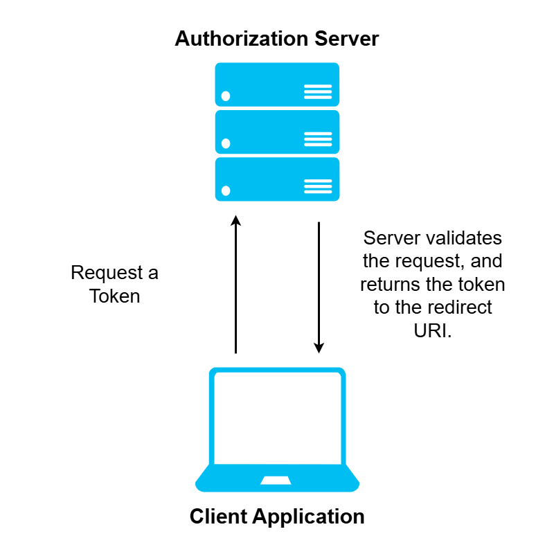
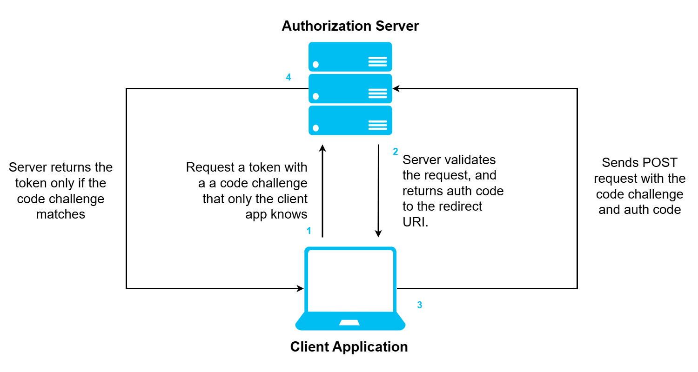
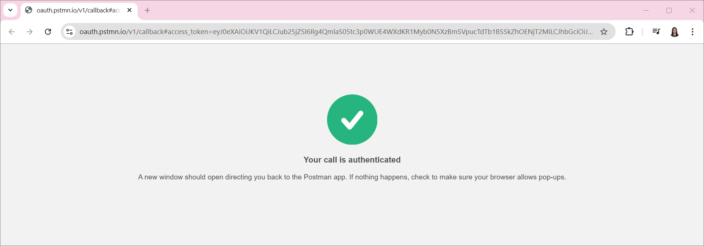

# [Azure AD Authorization Code Flow with Proof Key for Code Exchange](https://www.youtube.com/watch?v=FCmr2B8WaM8)

## Why Auth Code with PKCE was needed?

Before PKCE, we used to have implicit grant flow where the client application provides a redirect URL which is registered with Azure AD. The server will then validate the request, and generates a token. The server doesn't know whether a legitimate client is listening at the redirect URL. Another app can steal the token and impersonate the user.

This is the issue that Authorization Code flow is trying to mitigate.

## Implicit Grant Flow with Postman

1. Register an application.
2. Go to **Manage** > **Authentication** > **Add a Platform** > **Single Page Application**.

   - Provide `https://oauth.pstmn.io/v1/callback` for the redirect URI.
   - Check both A**ccess tokens (used for implicit flows)** and **ID tokens (used for implicit and hybrid flows)**.

     

3. Go to **Manage** > **API Permissions**. By default, Microsoft Graph's `User.Read` has already been added. This permission is enough since we will only be generating an auth token to call the **Microsoft Graph API**.

4. Go to **Overview** > **Endpoints**. Copy the OAuth 2.0 Authorization Endpoint (v2).

   [https://login.microsoftonline.com/your-directory-id/oauth2/v2.0/authorize](https://login.microsoftonline.com/your-directory-id/oauth2/v2.0/authorize)

5. Go to **Postman** > **Authorization**.

   1. Set **Auth Type** to _OAuth 2.0_.
   2. Set **Grant Type** to _Implicit Grant Type_.
   3. Check **Authorize using browser**.
   4. Paste the endpoint that you just copied into the **Auth URL**.
   5. Enter the client ID.
   6. Specify `user.read` for the **Scope**.
   7. Hit **Get New Access Token**. A consent window will pop-up if this is your first time logging in. You will then directly recieve the access token.

   

6. Test the access token by listing the blobs. Set the `Authorization` and `x-ms-version` headers.

## PKCE with Postman

Refer to the [example that accesses the Storage API](./09-storage-account-auth.md).
