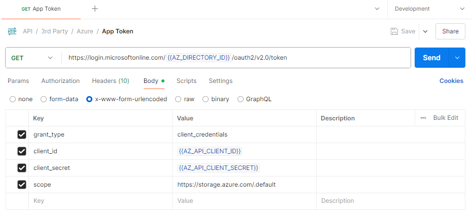
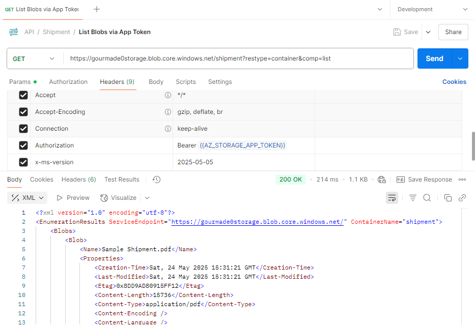

# Authorize Requests to Azure Storage

1. **Entra ID**
   1. [Application](https://learn.microsoft.com/en-us/azure/databricks/connect/storage/aad-storage-service-principal)
   2. User
2. **Shared Key**
   - Refers to the primary account Key, providing full access to all resources within the storage account. Found at **Security + Networking** > **Access Keys**.
3. **Shared Access Signature**
   - A URI that grants restricted access rights to specific resources, with limited permissions and a defined time period. Found at **Security + Networking** > **Shared Access Signature**.

Every request made against a secured resource in the Blob, File, Queue, or Table service must be authorized. Authorization ensures that resources in your storage account are accessible only when you want them to be, and only those users or applications to whom you grant access.

For optimal security, Microsoft recommends using Microsoft Entra ID with managed identities to authorize requests whenever possible.

Authorization with Microsoft Entra ID and managed identities provides superior security and ease of use over Shared Key authorization.

For scenarios where Shared Access Signature (SAS) are used, Micorosft recommends using a **user delegation SAS**.

## Authorization with Microsoft Entra ID

Azure Storage accepts OAuth 2.0 access tokens from the Microsoft Entra tenant associated with the subscription that contains the storage account. Azure Storage accepts access tokens for:

- Users and Groups
- Service Principals
- Managed Identities for Azure Resources
- Applications using permissions delegated by users

Azure Storage exposes a single delegation scope named `user_impersonation` that permits applications to take any action allowed by the user.

To request tokens for Azure Storage, specify the value `https://storage.azure.com/` for the resource ID.

### App Access

1. We'll be accessing the blob using Postman. Hence, we'll have to get Postman authenticated by Azure. Proceed with creating an app registration.
2. Go to **Storage Account** > **Access Control (IAM)**, add a role assignment (e.g., _Storage Blob Data Contributor_) to the app that you just registered.
3. Go to **App Registration** > **Overview** > **Endpoints** > Copy **OAuth 2.0 token ednpoint (v2)**.
4. Get the token using Postman.

   1. Set **Auth Type** to _Inherit auth from parent_.
   2. Go to Headers > set `Content-Type` to `application/x-www-form-urlencoded`.

      > [!NOTE]
      > For `application/x-www-form-urlencoded`, the body of the HTTP message sent to the server is essentially one giant query string.
      > Example: `grant_type=client_credentials&client_id=xxxx&client_secret=yyyy`

   3. Go to **Body** and set the following values.
      

5. List Blobs. Set the `Authorization` and `x-ms-version` headers.
   
