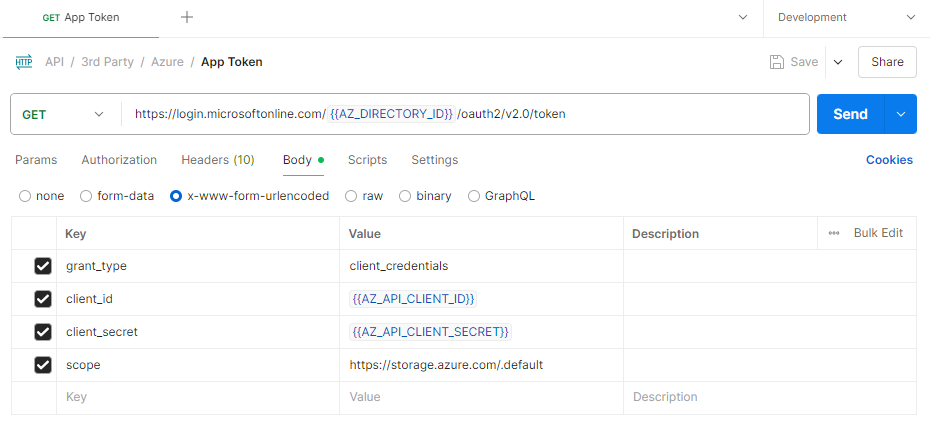
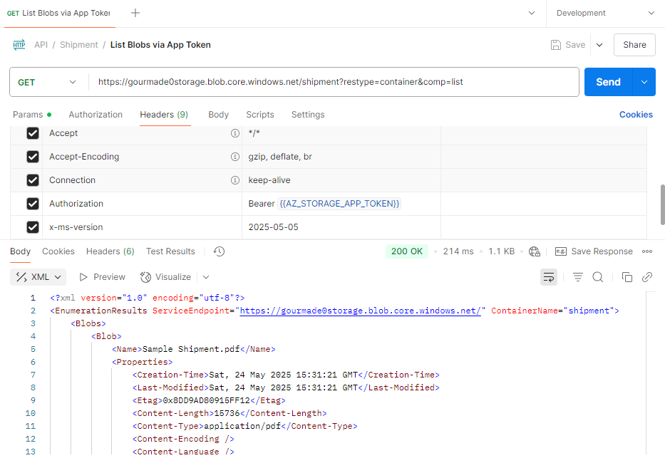
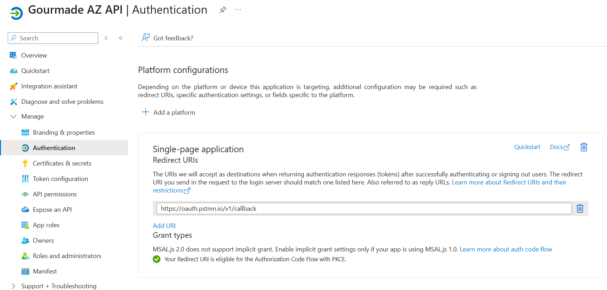
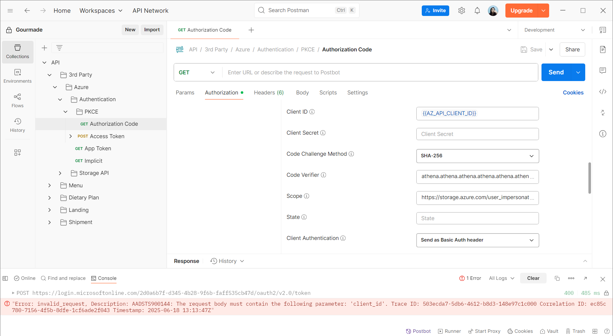
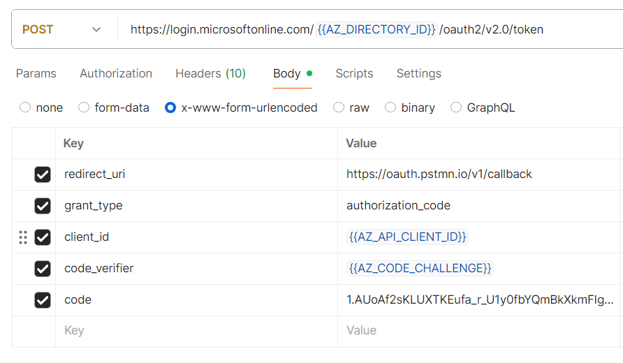

# Authorize Requests to Azure Storage

1. **Entra ID**
   1. [Application](https://learn.microsoft.com/en-us/azure/databricks/connect/storage/aad-storage-service-principal)
   2. User
2. **Shared Key**
   - Refers to the primary account Key, providing full access to all resources within the storage account. Found at **Security + Networking** > **Access Keys**.
3. **Shared Access Signature**
   - A URI that grants restricted access rights to specific resources, with limited permissions and a defined time period. Found at **Security + Networking** > **Shared Access Signature**.

Every request made against a secured resource in the Blob, File, Queue, or Table service must be authorized. Authorization ensures that resources in your storage account are accessible only when you want them to be, and only those users or applications to whom you grant access.

For optimal security, Microsoft recommends using Microsoft Entra ID with managed identities to authorize requests whenever possible.

Authorization with Microsoft Entra ID and managed identities provides superior security and ease of use over Shared Key authorization.

For scenarios where Shared Access Signature (SAS) are used, Micorosft recommends using a **user delegation SAS**.

## Authorization with Microsoft Entra ID

Azure Storage accepts OAuth 2.0 access tokens from the Microsoft Entra tenant associated with the subscription that contains the storage account. Azure Storage accepts access tokens for:

- Users and Groups
- Service Principals
- Managed Identities for Azure Resources
- Applications using permissions delegated by users

Azure Storage exposes a single delegation scope named `user_impersonation` that permits applications to take any action allowed by the user.

To request tokens for Azure Storage, specify the value `https://storage.azure.com/` for the resource ID.

### App Access

1. We'll be accessing the blob using Postman. Hence, we'll have to get Postman authenticated by Azure. Proceed with creating an app registration.
2. Go to **Storage Account** > **Access Control (IAM)**, add a role assignment (e.g., _Storage Blob Data Contributor_) to the app that you just registered.
3. Go to **App Registration** > **Overview** > **Endpoints** > Copy **OAuth 2.0 token endpoint (v2)**.
4. Get the token using Postman.

   1. Set **Auth Type** to _Inherit auth from parent_.
   2. Go to **Body** > set `Content-Type` to `application/x-www-form-urlencoded`.

      > [!NOTE]
      > For `application/x-www-form-urlencoded`, the body of the HTTP message sent to the server is essentially one giant query string.
      > Example: `grant_type=client_credentials&client_id=xxxx&client_secret=yyyy`

   3. Set the following values.
      

5. List Blobs. Set the `Authorization` and `x-ms-version` headers.
   

### User Access

1.  Register an application.
2.  Go to **Manage** > **Authentication** > **Add a Platform** > **Single Page Application**.

    - Provide `https://oauth.pstmn.io/v1/callback` for the redirect URI.
    - Check both **access tokens (used for implicit flows)** and **ID tokens (used for implicit and hybrid flows)**.

      

3.  Go to **Manage** > **API Permissions**. By default, Microsoft Graph's `User.Read` has already been added. Add another permission for the Azure Storage API, and select `user_impersonation`.

4.  Go to **Postman** > **Authorization**, and get an authorization code.

    1. Set **Auth Type** to _OAuth 2.0_.
    2. Set **Grant Type** to _Authorization Code (With PKCE)_.
    3. Check **Authorize using browser**.
    4. Fill in **Auth URL** by going to Azure Portal **Overview** > **Endpoints** > Copy **OAuth 2.0 Authorization Endpoint (v2)**.
    5. Fill in **Access Token URL** by going to Azure Portal **Overview** > **Endpoints** > Copy **OAuth 2.0 Token Endpoint (v2)**.
    6. Enter the client ID.
    7. Select SHA-256 for **Code Challenge Method**. This is the algorithm that will be used to hash the code challenge.
    8. Enter a minimum of 43 characters for the **Code Verifier**, this is the code challenge.
    9. Specify either `https://storage.azure.com/user_impersonation` or `https://storage.azure.com/.default` for the **Scope**. Note that you should use a fully qualified URI. If you only specify `user_impersonation`, you'll get an error saying _"The app Gourmade AZ API asked for scope user_impersonation that doesn't exist on the resource."_
    10. Hit **Get New Access Token**. A consent window will pop-up if this is your first time logging in. You will then directly recieve the access token.

    > [!WARNING]
    > It successfully generates the token. However, there's a console error showing up in Postman even though the client ID has already been included.
    > I've also already tried setting **Client Authentication** to **Send client credentials in body** and adding an origin header, but then, it will throw _"Tokens issued for the 'Single-Page Application' client-type may only be redeemed via cross-origin requests."_
    > Just ignore this error and proceed with the next step.
    > If you happen to know why this is happening, please don't hesitate to drop me a message — would really appreciate the help! 🙏💬

    

5.  Exchange the authorization code for an access token.

    1. Set **Auth Type** to _Inherit auth from parent_.
    2. Go to **Body** > set `Content-Type` to `application/x-www-form-urlencoded`.
    3. Set the following values.

    

6.  Test the access token by listing the blobs. Set the `Authorization` and `x-ms-version` headers.

Notice that you didn't need a `client_secret` for any of the steps. This is because you used Authorization Code with PKCE which is designed for public client like:

- Single Page Apps (SPAs)
  - Runs entirely in the browser.
  - Since the entire source code is available to the browser, they cannot maintain the confidentiality of a client secret, so a secret is not used for these apps.
- Mobile Apps
  - These apps are downloaded entirely to the device before they are run, but in this case you're downloading a binary file instead of uncompiled source code.
  - Hence, mobile apps can be reverse-engineered.
  - Anything bundled with the app - including secrets - can be extracted.
- Desktop Apps

These clients can't safely store a `client_secret`, so Azure AD allows them authenticate without one by using a Code Verifier + Code Challenge mechanism.
