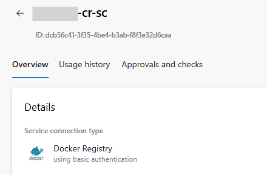

# Continuously Deploy Containers

## 1. Set-up your Azure Repository

- Authenticate with Azure Repos
- You can set-up the remote origin using either SSH or HTTPs. Git now recommends HTTPs.
- If you're using SSH, it is recommended to use **Personal Access Tokens** (PAT). Another way would be to authenticate using **SSH keys**. You can set-up PATs or SSH keys from the **User Settings** of Azure DevOps.
- On the other hand, if you're using HTTPs, use _Git Credential Manger_ which is available upon installing Git. On your initial push, a pop-up will open asking for you to log-in.

## 2. Create your Azure Container Registry

- You can activate an **Admin User** from the **Access Keys** page.
- If activated, you can use the registry name as username and admin user access key as password to `docker login` to your container registry.
- This will also add values to the following environment values once the App Service has been created.
  - `DOCKER_REGISTRY_SERVER_USERNAME`
  - `DOCKER_REGISTRY_SERVER_PASSWORD`
- If you don't activate this, you won't be able to authenticate your Web App via _Admin Credentials_.

  

## 3. Create a Managed Identity

- Instead of activating an _Admin User_, create a Managed Identity for the Web App instead.
- Assign the **AcRPull** role.

  

## 4. Create a Web App

- Create a new Web App using Linux for Containers.
- Check the deplyoed website.

## 5. Create a Service Connection

> [!WARNING]  
> This is actually an incorrect step and was only included for learning purposes.

- Service connections are authenticated connections between Azure Pipelines and external or remote services that you use to execute tasks in a job.
- For example, your pipelines might use the following categories of service connections.
  - Azure Subscriptions
  - Different build servers or file servers such as a standard GitHub Enterprise Server service connection to a GitHub repository.
  - Jenkins Service Connection
  - Services installed on remote computers such as an Azure Resource Manager service connection to an Azure Virtual Machine with a managed service identity.
  - External services such as a service connection to a Docker Registry, Kubernetes cluster, or Maven repository.
- Go to **Project Settings** > **Pipelines** > **Service Connections**.
- Select **Azure Resource Manager** as the type of service connection.
- Limit the access to the resource group of the project.

  

## 6. Write the YML File

- You can just use the **Docker: Build and push an image to Azure Container Registry** template.
- Upon using this template, this will actually create a different service connection. It did not pick up the service connection that you just created. That's why you'll suddenly have more service connections than you initially created.

  

- Every time you use this template and abort the creation of the pipeline, the service connection has already been created.

- If you try to change the ID of the `dockerRegistryServiceConnection` to what was created from the previous step, you'll encounter an error.

  

- The authentication type that the template used is **Service Principal**.

  

- You can also use **Basic Authentication**, if you have activated an Admin User for the Azure Container Registry.

  

- When using Service Principal Authentication from the template, a new application is automatically registered in the background. As a result, each trial and aborted pipeline creation generates a new application with a unique client secret.

  

### When to use a Service Principal?

While most articles would recommend using a Managed Identiy over Service Principal because no credentials have to be stored and rotated, Microsoft does not recommend it for this case.

Use a Service Principal when a **service** or a platform needs access to **resources**.

You should use a Service Principal to provide registry access in headless scenarios. That is, an application, service, or script that must push or pull container registries in an automated or otherwise unattended manner.

> [!NOTE]
> **Headless Authentication** means no interactive log-in, think of popping up a browser window. Which really means, whatever needs to access your container registry can do so without user interaction.

### When to use a Managed Identity?

Use Managed Identity when you want to authenticate between **resources**. Remember that service principals are always linked to an Azure Resource, not to an application or 3rd party connector.

For example, you'd want to set-up a **user-assigned** or **system-assigned** managed identity on a Linux VM to access container images from your container registry.

If you try to use a service connection authenticated with Managed Identiy, you'll get the following error.

If you are choosing managed identity while creating service connection in Azure DevOps, then you should use Azure DevOps Self-Hosted Agent. [Learn more.](https://stackoverflow.com/questions/76434372/unhandled-could-not-fetch-access-token-for-managed-service-principal-in-azure)
