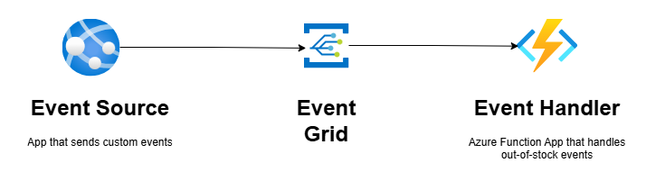

# Azure Event Grid

This is a simple console app that demonstrates how to publish events to Azure Event Grid.
The example is intentionally minimal and focuses on the concept rather than implementation details.

## Scenario

A customer places an order.
The server processes the order and updates the product inventory.
If the stock count drops to zero, it triggers an `OutOfStock` event, which is published to **Event Grid**.

A subscribed **event handler** (e.g., Azure Function) can then:

1. Unpublish the product from the online shop interface.
2. Notify the operations team that the product is out of stock.

## Why Event Grid?

This use case is a great fit for Azure Event Grid over Azure Service Bus because:

- We only need lightweight notifications of state changes.
- We don't require complex payload processing.

If the handler needs the full payload (for example, the entire order object), then Azure Service Bus would be a better choice.

## Architecture Overview

